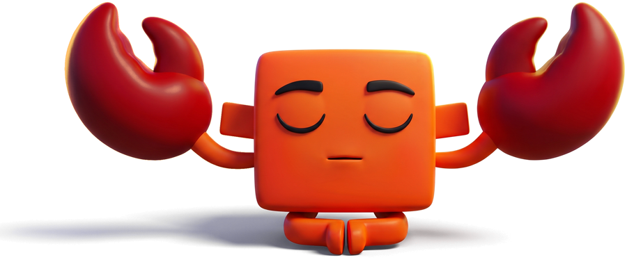

<p align="center">
  
</p>

<h1 align="center">CLAW</h1>

**A working method for Claude Code, installed in your project in one command.**

Claude Code gives you agents, hooks and skills, but no method. CLAW adds one:
the same rules and the same team of agents in every project, kept up to date
from one source.

**Contents:** [What you get](#what-you-get) · [Install](#install) ·
[Everyday use](#everyday-use) · [/claw in Claude Code](#claw-in-claude-code) ·
[claw in the terminal](#claw-in-the-terminal) · [Agents](#agents) ·
[Profiles](#profiles) · [Talking to it](#talking-to-it) · [Settings](#settings)

---

## What you get

- **Claude works from evidence.** It cites only what it read or ran, says what it
  did not check, finds the cause before fixing, and asks when a request is unclear.
- **Small, safe changes.** No unrequested refactoring, tests never weakened to go
  green. Commits, installs and anything irreversible wait for your ok.
- **A team sized to the task.** A coordinator plans and hands work to specialised
  agents; small changes it does itself.
- **Work state across sessions.** `docs/TODO.md`, `docs/status.md` and
  `docs/roadmap.md` say where the work is, and every session starts from them.
- **Safety hooks.** Claude cannot skip your git hooks, relax a linter
  configuration, or edit a file before checking what uses it.
- **One source, many projects.** Update CLAW once, then bring each project up to
  date. What you adapted stays.

---

## Install

Once per machine. You need Claude Code, git and Python 3.11 or later.

**macOS · Linux**

```bash
git clone https://github.com/290990-collab/CLAW.git ~/.claude/CLAW
python ~/.claude/CLAW/CLAW-eng/claw.py setup
```

**Windows · PowerShell**

```powershell
git clone https://github.com/290990-collab/CLAW.git $HOME\.claude\CLAW
python $HOME\.claude\CLAW\CLAW-eng\claw.py setup
```

`setup` shows what it writes and asks for your ok. It adds the `/claw` skill to
Claude Code and the `claw` command to `~/.local/bin`. If that folder is not on
your PATH, `setup` tells you: add it and open a new terminal.

Then, in each project: open Claude Code in the project folder and run
`/claw install`.

---

## Everyday use

| I want to… | Do this |
|---|---|
| Set up a project | In Claude Code, in the project: `/claw install`. It asks five questions, shows every file it will write and waits for your ok |
| Get a new CLAW release | In a terminal: `claw update`. It lists what arrives and asks before merging |
| Bring a project to the new release | In Claude Code, in that project: `/claw update`. Your adaptations stay |
| See if a project is behind | In a terminal, in the project folder: `claw status` |
| Check that a project is healthy | `claw doctor`, or `/claw fix` to also repair it |
| Stop and resume later | Say `safe pause`. Claude writes where things are in `docs/TODO.md` |

`claw update` touches only CLAW itself. Each project moves when you run
`/claw update` in it, so nothing changes in a project you are not looking at.

---

## /claw in Claude Code

One skill, one action at a time. `/claw` alone lists the actions.

| Action | What it does |
|---|---|
| `/claw install` | Sets up CLAW in this project |
| `/claw update` | Brings this project to the CLAW version you have, keeping your changes |
| `/claw fix` | Checks the installation, explains every finding, puts back missing files |
| `/claw add <agent or guide>` | Adds an agent (for example `frontend`) or a guide |
| `/claw remove <agent or guide>` | Removes it from this project |
| `/claw change` | Changes the profile or the orchestration |
| `/claw share` | Makes a change you made here part of CLAW, for every project |
| `/claw tune` | Adjusts each agent's model and effort to this project |
| `/claw memory` | Finds stale facts in Claude's memory of this project |
| `/claw comply <rule>` | Measures how often Claude follows a rule. Uses your tokens, so it asks first |
| `/claw uninstall` | Removes CLAW. What you adapted goes to `.claude/framework-archive/` |

Every action that writes shows its plan first and waits for your ok.

---

## claw in the terminal

| Command | What it does |
|---|---|
| `claw update` | Takes the new CLAW release. Stops if you have uncommitted changes in it |
| `claw status` | CLAW's version against the release; with a project in this folder, its version and what it is missing |
| `claw doctor` | Checks the project in this folder. `--strict` fails on warnings too, `--json` is for CI |

Commands that write ask before writing; add `--yes` to skip the question.
`claw --help` lists the others (`setup`, `install`, `down`, `repair`,
`uninstall`, `report`, `source`, `skills`): `/claw` runs them for you.

---

## Agents

29 agents. A project installs only the ones its profile and your answers need.

**Always installed:**

| Agent | What it does |
|---|---|
| `explorer` | Finds where things live, cheaply |
| `architect` | Plans changes that cross files or contracts |
| `implementer` | Writes the planned change |
| `tester` | Tests invariants and contracts |
| `refactorer` | Cleans up the structure, behaviour unchanged |
| `final-reviewer` | Rereads the diff and reruns the tests before an important change is called done |

**Added by profile or on request:**

| Agent | What it does |
|---|---|
| `api-scout` | Checks third-party APIs before code relies on them |
| `debugger` | Finds the cause of a defect nobody can explain |
| `silent-failure-hunter` | Finds swallowed errors and faults hidden behind defaults |
| `comment-analyzer` | Finds comments that no longer tell the truth |
| `conversation-analyzer` | Finds corrections that keep repeating in past sessions |
| `frontend` | Views, components, style, motion, accessibility |
| `deploy` | Simple hosting: build, domain, secrets. Never with `infra` |
| `infra` | Infrastructure as code, environments, migrations. Never with `deploy` |
| `data-ingestion` | Pipelines that bring external data in |
| `results-analyst` | Reads measured results: is the change real, and why |
| `literature` | Finds and reads publications |
| `skill-runner` | Runs another author's skill for the coordinator |
| `market-researcher` | Audience, alternatives, the promise the product keeps |
| `campaign-planner` | Channel, cadence, headline, what to measure |
| `copywriter` | Writes the copy, every claim with its proof |
| `visual-designer` | Specifies images and layouts |
| `content-analyst` | Reads the numbers after publishing |

**Reviewers of the critical surface.** `/claw install` asks what could make the
work wrong even with perfect code, and adds the matching reviewer:

| Agent | Watches for |
|---|---|
| `security-reviewer` | Someone could abuse it |
| `scientific-reviewer` | The conclusions might not hold |
| `data-quality-reviewer` | The data might be wrong upstream |
| `compliance-reviewer` | Personal data, licences, terms of use |
| `perf-analyst` | A declared performance requirement |
| `claim-reviewer` | Public claims about the product |

---

## Profiles

The first question of `/claw install`. It picks the extra agents, the guides and
the work cycle. `/claw change` switches it later.

| Profile | For |
|---|---|
| `software` | Applications, services, CLI and desktop tools |
| `library` | Libraries and packages: the public API is the product |
| `web` | Sites and web apps where the look matters |
| `data` | Acquisition, transformation, storage |
| `research` | The product is reproducible evidence |
| `llm` | A language model produces what the code uses |
| `marketing` | Positioning, copy, images, campaigns |

The orchestration is `orchestrator-worker` by default: the coordinator hands out
work and collects reports. `agent-teams` lets agents message each other; it is
experimental and needs an interactive session.

---

## Talking to it

**Rule names.** Write a rule's name in a message and Claude applies it to the
current work, for example `minimal change here`, `proof level?`,
`not a finding, skip it`. The 35 names are listed in
[`CLAW-eng/output-styles/reporting.md`](CLAW-eng/output-styles/reporting.md).

**Reference codes.** A reply with three or more findings, decisions or options
numbers them (`F1`, `D1`, `O1`, …). Answer with the codes: `keep D1, drop O2`.

**Aliases.** Send one as the whole message:

| Alias | You get |
|---|---|
| `scr` | The last reply, simplified and shorter |
| `foc` | Only the real signal of the last reply |
| `ref` | The last reply with reference codes |
| `eli` | The last reply explained simply |

---

## Settings

| Setting | Effect |
|---|---|
| `language` in Claude Code's settings | The language Claude answers in. Without it, the language of your messages |
| `FRAMEWORK_GATEGUARD=off` | Turns off the hook that checks a file's users before its first edit |
| `accepted` in `.claude/framework.json` | Warnings of `claw doctor` you keep on purpose, each with a reason |

To keep a warning, copy its code from the doctor's output into `accepted`:

```
WARN  TOKEN_BUDGET      CLAUDE.md: 2400 project words against 1900 of kernel — 4300 in all, ≈5700 tokens paid at every spawn
```

```json
{
  "source": "...",
  "version": "2.0.5",
  "profile": "software",
  "accepted": {
    "TOKEN_BUDGET": "large monorepo: CLAUDE.md is long on purpose"
  }
}
```

Errors cannot be accepted: they must be fixed.

---

## Version 2.0.5

MIT, see [LICENSE](LICENSE).
